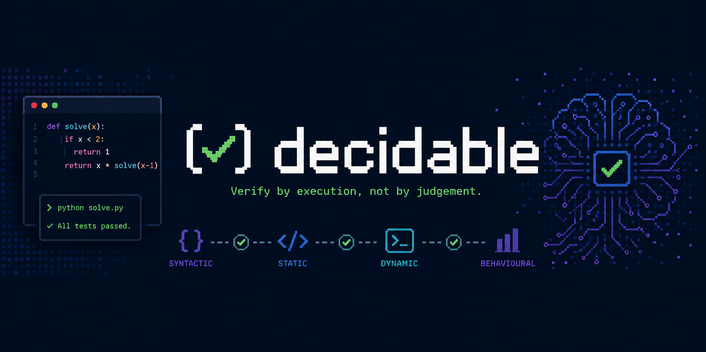

<p align="center">
  
</p>

# decidable

[](https://github.com/maximebxyer/decidable/actions/workflows/ci.yml)

An evaluation harness for agents whose outputs can be **verified by execution**, not
judged by another model.

---

## Why this exists

Most agent evaluation today relies on LLM-as-judge. That approach is unfalsifiable,
non-reproducible, and expensive. It also throws away a fact that matters in the domains
where agents are actually deployed: **correctness is often decidable**.

If an agent emits Python, you can parse it, type-check it, run it, and test properties of
its behaviour. If it emits SQL, you can run it against a fixture database and compare
result sets. If it emits industrial control logic, you can check invariants. In all these
cases a judge model is not just unnecessary, it is strictly worse than executing the
artifact.

`decidable` answers a narrow question well: *did the agent produce an artifact that is
verifiably correct, and if not, exactly where did it break?*

## Status

**v0.1.** All six milestones are built.

| # | Milestone | State |
|---|-----------|-------|
| 1 | Core models and the Verifier protocol | **shipped** |
| 2 | Python verifier stack (`ast.parse`, `mypy`/`ruff`, subprocess, `pytest`) | **shipped** |
| 3 | Runner with caching and reproducibility metadata | **shipped** |
| 4 | Report with failure breakdown by stage | **shipped** |
| 5 | CLI and YAML suite format | **shipped** |
| 6 | Worked example and one-command reproduction | **shipped** |

It is v0.1 and small on purpose: Python artifacts only, five built-in verifiers, sequential
execution, no hosted anything. Every code block below is executed by the test suite, and
the numbers further down are the real output of the command in the next section.

## Try it

```
git clone https://github.com/maximebxyer/decidable
cd decidable
uv sync --extra python
uv run decidable run examples/python_codegen/suite.yaml \
  --agent examples/python_codegen/agent.py:agent
```

That runs six Python code-generation tasks against a canned agent whose answers break at
six different points, and prints the table below. It exits 1, because five of the six fail
on purpose — a worked example where everything passes demonstrates nothing. See
[examples/python_codegen/](examples/python_codegen/) for what each answer gets wrong.

## Core concepts

Four nouns carry the whole design. The codebase uses these words and no synonyms.

- **Task** — a single evaluation unit: a prompt, optional context and fixtures. A task is
  pure data, so it serializes and can be stored.
- **Agent** — anything callable that maps a Task to an artifact. Agents are user-supplied;
  the harness ships thin adapters, not integrations. A plain function satisfies it.
- **Verifier** — a pure function from artifact to Verdict. **It never calls a model.**
- **Verdict** — `PASS`, `FAIL`, or `ERROR`, plus structured evidence.

A **Suite** is a set of Tasks. A **Run** is a Suite executed against one Agent, producing
a **Report**.

An artifact is whatever the agent produced. In v0.1 that is text, because v0.1 verifies
generated Python source.

## The verifier stack

Verifiers are ordered cheap to expensive and short-circuit on the first non-pass:

| Stage | Question | Example |
|-------|----------|---------|
| `SYNTACTIC` | does it parse? | `ast.parse` |
| `STATIC` | does it type-check, lint, satisfy a schema? | `mypy`, `ruff` |
| `DYNAMIC` | does it execute without crashing, within a timeout? | subprocess run |
| `BEHAVIOURAL` | does it satisfy property tests, invariants, expected outputs? | `pytest` |

This ordering is the point: it turns a pass rate into a **failure taxonomy**. An agent
that scores 17% is uninformative. Here is the same run, as the command above prints it:

```text
python-codegen: 6 tasks against examples/python_codegen/agent.py:agent
passed 1  failed 5  errored 0  (17% pass rate)
                        by stage                         
┌─────────────┬────────┬────────┬─────────┬─────────────┐
│ stage       │ passed │ failed │ errored │ not reached │
├─────────────┼────────┼────────┼─────────┼─────────────┤
│ syntactic   │      5 │      1 │       0 │           0 │
│ static      │      3 │      2 │       0 │           1 │
│ dynamic     │      2 │      1 │       0 │           3 │
│ behavioural │      1 │      1 │       0 │           4 │
└─────────────┴────────┴────────┴─────────┴─────────────┘
                              what did not pass                               
┌──────────┬────────┬─────────────┬──────────────────────────────────────────┐
│ task     │ status │ stage       │ why                                      │
├──────────┼────────┼─────────────┼──────────────────────────────────────────┤
│ roman    │ fail   │ syntactic   │ syntax error on line 2: '{' was never    │
│          │        │             │ closed                                   │
│ anagram  │ fail   │ static      │ 1 type error: Incompatible return value  │
│          │        │             │ type (got "Literal[False] | str",        │
│          │        │             │ expected "bool")                         │
│ primes   │ fail   │ static      │ 1 lint violation: `os` imported but      │
│          │        │             │ unused                                   │
│ balanced │ fail   │ dynamic     │ exited 1: ZeroDivisionError: integer     │
│          │        │             │ division or modulo by zero               │
│ rle      │ fail   │ behavioural │ property tests failed                    │
└──────────┴────────┴─────────────┴──────────────────────────────────────────┘
```

"17%" tells you nothing. This tells you one answer never parsed, one lies about its return
type, one has an unused import, one divides by zero at import — and one, `rle`, passes
every check short of running the tests and still returns the wrong answer. That last row
is the case for this project: no judge model is needed, or wanted, to decide it.

The **not reached** column is what makes this honest: it distinguishes "type-checking
failed" from "type-checking was never attempted because the code did not parse". Each row
counts tasks rather than verdicts, so the rows are comparable even when a stage holds two
verifiers.

Because the ordering carries this meaning, `VerifierStack` refuses to be built out of
order — a `BEHAVIOURAL` verifier cannot precede a `SYNTACTIC` one. Repeating a stage is
fine; going backwards raises `ValueError`.

When a verifier does not pass, the verifiers after it are never run. They are recorded as
**skipped**, not as verdicts, so a report can distinguish "type-checking failed" from
"type-checking was never attempted".

## `ERROR` is not `FAIL`

This is the sharpest decision in the project, and it is enforced by the types rather than
by convention.

- **`FAIL`** means the agent produced a bad artifact.
- **`ERROR`** means *the verifier itself could not run* — `mypy` is not installed, a
  fixture is missing, the harness has a bug. It says nothing about the agent.

Folding one into the other produces dishonest numbers, so they are kept apart everywhere:

- A `Verdict` carries a `HarnessError` **if and only if** its status is `ERROR`. An
  `ERROR` without one is a validation error, and so is a `PASS` or `FAIL` that carries
  one. You cannot construct a misleading verdict.
- Any exception escaping a verifier is caught by the stack and converted into an `ERROR`
  verdict with the traceback attached. A crashing verifier can never surface as a `FAIL`.
- `ERROR` short-circuits the stack exactly like `FAIL`. If `mypy` could not run, the
  verdicts after it would not be trustworthy.
- Rolling up many verdicts, `ERROR` dominates `FAIL`, which dominates `PASS`. Rolling up
  *nothing* is `ERROR`: if no verdict was reached, nothing was decided, and that is a
  harness condition rather than a passing agent.

There is no fourth status. "Not reached" is represented by absence.

## Evidence, not scores

Every verdict carries evidence, and a bare boolean is treated as a bug. `Evidence` has
three fields:

- `summary` — required, non-empty, one line. This is what the failure taxonomy prints.
- `detail` — free text for reproducing and understanding: a traceback, a diff, a failing
  assertion.
- `data` — a flat map of scalars and scalar tuples, for whatever is structured enough to
  aggregate across a run (counting `mypy` error codes over a whole suite, say).

`data` is deliberately not recursive. It exists to be aggregated, and nested blobs do not
aggregate; long unstructured output belongs in `detail`.

The shape of `data` is each family of verifiers' own business. Process fields like exit
codes live there rather than on the base model, because a parse verifier has no exit code
— it has a source position.

## Install

Python 3.11+ and [uv](https://docs.astral.sh/uv/). The package is **not on PyPI yet**, so
clone it:

```
git clone https://github.com/maximebxyer/decidable
cd decidable
uv sync --extra python
```

The core library depends on `pydantic`, `rich`, `typer` and `pyyaml`. The `python` extra
adds `mypy`, `ruff` and `pytest` — the tools the shipped Python verifiers shell out to.
Without it everything else still works, and a verifier whose tool is missing returns
`ERROR` rather than crashing.

## Suites and the CLI

A suite is a YAML file: a name, the verifier stack, and the tasks.

```yaml
name: python-codegen

verifiers:
  - parse
  - mypy:
      strict: true
  - ruff
  - execute:
      timeout_s: 10
  - pytest

tasks:
  - id: fizzbuzz
    prompt: |
      Write fizzbuzz(n: int) -> str ...
    tests: tests/fizzbuzz.py
```

A verifier entry is a bare name or a single-key mapping of name to options. Paths are
relative to the suite file. `tests:` is required on every task when the stack includes
`pytest`, and each task's tests are hashed into that verifier's fingerprint, so editing a
test invalidates its cached verdict.

**A suite file can name only the five built-in verifiers** — `parse`, `mypy`, `ruff`,
`execute`, `pytest`. It cannot name your code, which means it cannot import or run any. For
a verifier of your own, compose a `VerifierStack` in Python and call `run` directly, as
[Running a suite](#running-a-suite) shows. Anything more than this — entry points, dotted
paths — is a plugin system, and this project will grow one when someone actually needs it.

```
decidable run SUITE (--agent SPEC | --artifacts DIR)
                    [--cache-dir DIR] [--json PATH] [--quiet]
```

`--agent` is `module:callable` or `path/to/file.py:callable`. `--artifacts` points at a
directory of already-generated files named `<task id>.py`, for verifying output you
produced some other way; a missing file is an `ERROR` on that task, never a `FAIL`.

Exit codes carry the distinction into your shell, so CI can tell a worse agent from a
broken harness without parsing anything:

| Code | Meaning |
|------|---------|
| `0` | every task passed |
| `1` | some task failed — the agent's output was wrong |
| `2` | some task errored, or the suite could not be loaded |

`ERROR` dominates `FAIL`, as it does everywhere else in the project.

## Quickstart

The full four-stage stack, run against two artifacts. `tests/test_readme.py` executes this
block, assertions included, so it is true or the test suite fails.

```python
from decidable import Stage, Status
from decidable.verifiers import VerifierStack
from decidable.verifiers.python import (
    ExecuteVerifier,
    MypyVerifier,
    ParseVerifier,
    PytestVerifier,
    RuffVerifier,
)

PROPERTIES = """
from solution import fizzbuzz


def test_multiples_of_three():
    assert fizzbuzz(3) == "fizz"


def test_plain_numbers():
    assert fizzbuzz(1) == "1"
"""

stack = VerifierStack(
    [
        ParseVerifier(),
        MypyVerifier(),
        RuffVerifier(),
        ExecuteVerifier(timeout_s=10.0),
        PytestVerifier(PROPERTIES),
    ]
)

# Type-checks and runs, but gets the answer wrong: it survives to the last stage.
wrong = stack.run("def fizzbuzz(n: int) -> str:\n    return str(n)\n")

assert wrong.status is Status.FAIL
assert [v.verifier.name for v in wrong.verdicts] == [
    "python_parse",
    "mypy",
    "ruff",
    "python_execute",
    "pytest",
]
assert wrong.verdicts[-1].verifier.stage is Stage.BEHAVIOURAL
assert wrong.skipped == ()

# Fails to type-check, so the three more expensive stages are never attempted.
untyped = stack.run("def fizzbuzz(n: int) -> str:\n    return n\n")

assert untyped.status is Status.FAIL
assert untyped.verdicts[-1].verifier.name == "mypy"
assert untyped.verdicts[-1].evidence.data["codes"] == ("return-value",)
assert [ref.name for ref in untyped.skipped] == ["ruff", "python_execute", "pytest"]
```

Two agents, both "50%". The verdict chain says one is nearly right and the other does not
type-check.

## The Python verifiers

Importable from `decidable.verifiers.python`. Every one of them decides by parsing,
type-checking, linting or running the artifact. None of them call a model.

| Verifier | Stage | Decides with | Evidence it records |
|----------|-------|--------------|---------------------|
| `ParseVerifier()` | `SYNTACTIC` | `ast.parse` | line, column, and the offending source line with a caret |
| `MypyVerifier(strict=True, timeout_s=120.0)` | `STATIC` | `mypy --output=json` | error count, distinct error codes, mypy version |
| `RuffVerifier(timeout_s=60.0)` | `STATIC` | `ruff check --isolated` | violation count, distinct rule codes, ruff version |
| `ExecuteVerifier(timeout_s=10.0)` | `DYNAMIC` | running the artifact | exit code, stderr, whether it timed out |
| `PytestVerifier(tests, module_name="solution", timeout_s=60.0)` | `BEHAVIOURAL` | `pytest` | the failing assertion, pytest version |

`PytestVerifier` takes its property tests at construction; they import the artifact by
module name (`from solution import fizzbuzz`). That is what keeps `verify` a function of
the artifact alone.

The distinct-codes field is the one that pays off across a suite: it turns "this agent
fails type-checking" into "this agent returns the wrong type in 30% of tasks".

Two details worth knowing, both consequences of `ERROR` not being `FAIL`:

- **A missing tool is `ERROR`**, with a summary naming the extra to install. `mypy` not
  being installed says nothing about the agent.
- **`pytest` collecting no tests is `ERROR`**, not `PASS`. An empty test run decides
  nothing, and reporting it as success would be the most flattering lie the harness could
  tell. But an artifact the tests cannot *import* is a `FAIL` — that one is the agent's
  doing.

`mypy` and `ruff` run against a generated empty config, so the configuration of whatever
project `decidable` happens to be running inside can never change a verdict.

## Running a suite

A `Suite` is a set of tasks. An `Agent` is anything callable that turns a task into an
artifact. `run` puts the two together and gives you a `Report`.

Verifiers are not stored on a task — a task stays pure data — so you pass a factory that
builds the stack for each task. That is what lets every task carry its own property tests.

```python
from decidable import Status, Suite, Task
from decidable.report import render_terminal
from decidable.runner import run
from decidable.verifiers import VerifierStack
from decidable.verifiers.python import ParseVerifier

suite = Suite(
    name="fizzbuzz",
    tasks=(
        Task(id="works", prompt="write fizzbuzz"),
        Task(id="broken", prompt="write fizzbuzz"),
    ),
)


def agent(task: Task) -> str:
    """Stands in for a model. Yours would call one; the harness does not care."""
    if task.id == "broken":
        return "def fizzbuzz(:\n"
    return "def fizzbuzz(n: int) -> str:\n    return str(n)\n"


report = run(suite, agent, stack_for=lambda task: VerifierStack([ParseVerifier()]))

assert [r.task_id for r in report.results] == ["works", "broken"]
assert report.results[0].status is Status.PASS
assert report.results[1].status is Status.FAIL
assert report.metadata.suite_name == "fizzbuzz"

render_terminal(report)
```

An agent that raises is recorded as an `ERROR` on that task and the rest of the suite still
runs — it produced no artifact, so nothing about it was decided, and that is never counted
as a failing agent.

### Caching

Pass `cache_dir` and a task whose artifact and verifiers match a previous run reuses that
run's verdicts:

```
report = run(suite, agent, stack_for=..., cache_dir=Path(".decidable-cache"))
```

The key covers the artifact, the ordered `fingerprint` of every verifier in the stack, and
the decidable version. That is what makes a hit honest: upgrade `mypy`, change
`strict=True` to `False`, or edit a single property test, and the fingerprint changes and
the work is redone. A corrupt or unreadable entry is treated as a miss — a cache is an
optimisation, and one that can change a verdict is a bug.

Caching is off unless you ask for it. Nothing is ever written to your working directory
without a `cache_dir`.

### The report

`render_terminal(report)` prints the taxonomy; `render_json(report)` gives the same thing
plus the raw results for a machine to read.

## Writing your own verifier

Anything with `name`, `stage` and `verify` satisfies the protocol. Nothing here is
Python-specific except the verifiers above.

```python
import ast

from decidable import Evidence, Stage, Status, Verdict, VerifierRef
from decidable.verifiers import VerifierStack


class AnnotatesReturnTypes:
    name = "return_annotations"
    stage = Stage.STATIC
    # Must change whenever this verifier's answer could. Nothing configures
    # this one, so a version is enough.
    fingerprint = "return_annotations/1"

    def verify(self, artifact: str) -> Verdict:
        me = VerifierRef(name=self.name, stage=self.stage, fingerprint=self.fingerprint)
        bare = tuple(
            node.name
            for node in ast.walk(ast.parse(artifact))
            if isinstance(node, ast.FunctionDef) and node.returns is None
        )
        if bare:
            return Verdict(
                status=Status.FAIL,
                verifier=me,
                evidence=Evidence(
                    summary=f"{len(bare)} function(s) lack a return annotation",
                    data={"functions": bare},
                ),
            )
        return Verdict(
            status=Status.PASS,
            verifier=me,
            evidence=Evidence(summary="every function annotates its return type"),
        )


result = VerifierStack([AnnotatesReturnTypes()]).run("def fizzbuzz(n):\n    return n\n")

assert result.status is Status.FAIL
assert result.verdicts[0].evidence.data["functions"] == ("fizzbuzz",)


# A verifier that breaks is an ERROR, never a FAIL.
class BrokenVerifier:
    name = "needs_a_tool_that_is_missing"
    stage = Stage.STATIC
    fingerprint = "broken/1"

    def verify(self, artifact: str) -> Verdict:
        raise FileNotFoundError("mypy: command not found")


crashed = VerifierStack([BrokenVerifier()]).run("x = 1\n")

assert crashed.status is Status.ERROR
assert crashed.verdicts[0].error is not None
assert crashed.verdicts[0].error.exception_type == "FileNotFoundError"
assert "FileNotFoundError" in crashed.verdicts[0].error.traceback
```

Note what a verifier does *not* do: it does not time itself (the stack stamps
`duration_s`), and it does not catch its own breakage to report a `FAIL` (the stack turns
exceptions into `ERROR`). If it can detect its own breakage cleanly, it returns
`error_verdict(...)` instead of raising.

## API as it stands today

Everything importable right now. This is the whole public surface; each entry is one we
intend to keep.

From `decidable`:

| Name | What it is |
|------|-----------|
| `Task` | id, prompt, optional context and fixtures |
| `Suite` | a name and a set of tasks with unique ids |
| `Agent` | protocol: `__call__(task) -> Artifact` |
| `Verdict` | status, verifier, evidence, optional `HarnessError`, `duration_s` |
| `Status` | `PASS` / `FAIL` / `ERROR` |
| `Stage` | `SYNTACTIC` / `STATIC` / `DYNAMIC` / `BEHAVIOURAL`, with `.rank` |
| `Evidence` | `summary`, `detail`, `data` |
| `HarnessError` | exception type, message, traceback |
| `VerifierRef` | a verifier's name, stage and fingerprint, for reports |
| `TaskResult` | one task's verdicts, its skipped verifiers, the artifact digest |
| `RunMetadata` | versions, platform, suite and agent name, timestamps, cache stats |
| `Report` | metadata plus task results |
| `roll_up` | reduce verdicts to one status, `ERROR` dominating |
| `Artifact` | type alias, currently `str` |
| `EvidenceValue` | what `Evidence.data` values may be |

From `decidable.runner`: `run(suite, agent, stack_for=..., cache_dir=...) -> Report`.

From `decidable.report`:

| Name | What it is |
|------|-----------|
| `summarise` | a run's headline counts, agent errors kept separate |
| `breakdown` | per-stage task counts, including what was never reached |
| `render_terminal` | the tables shown above |
| `render_json` | metadata, summary, breakdown and results as JSON |
| `RunSummary`, `StageBreakdown` | what those two return |

From `decidable.suite_file`: `load(path) -> LoadedSuite` (a `Suite` and its `stack_for`),
`SuiteFileError`, and `BUILT_INS`.

From `decidable.verifiers`:

| Name | What it is |
|------|-----------|
| `Verifier` | protocol: `name`, `stage`, `verify(artifact) -> Verdict` |
| `VerifierStack` | ordered composition, short-circuits on the first non-pass |
| `StackResult` | the verdicts produced and the verifiers skipped |
| `error_verdict` | build an `ERROR` verdict for breakage you detected yourself |

From `decidable.verifiers.python`: `ParseVerifier`, `MypyVerifier`, `RuffVerifier`,
`ExecuteVerifier`, `PytestVerifier` — see [the table above](#the-python-verifiers).

All models are frozen and reject unknown fields. The package is typed (`py.typed`) and
checked with `mypy --strict`.

Timeouts are recorded in each verifier's `fingerprint` rather than in `RunMetadata`,
because a stack can differ per task and there is no single run-level answer. There are no
seeds to record: nothing in v0.1 is random.

## Design principles

- **Verifiers never call models.** This is the whole thesis. A verifier that needs a model
  is not a verifier.
- **`ERROR` is not `FAIL`.** Kept distinct in types, storage, and reporting.
- **Evidence over scores.** Every verdict carries enough context to reproduce it.
- **Reproducibility is a feature.** A report that cannot be re-derived is worthless.
- **Small surface area.** Every public API is one we have to keep. Composition over
  configuration flags.

## When not to use this

If your task's correctness is a matter of taste — tone, style, helpfulness, whether a
summary is *good* — this is the wrong tool, and no amount of harness will make it the
right one. `decidable` is deliberately not a general-purpose eval framework, and it has no
opinion about tasks it cannot decide.

It is also Python-only in v0.1, by choice rather than by accident.

## Safety

`ExecuteVerifier` and `PytestVerifier` **run the artifact**. They run it as a subprocess of
the current interpreter, in a temporary directory, under a timeout, with a lightly
sanitised environment.

That is **not a security boundary**, and nothing here pretends otherwise. It contains a
crash and stops a runaway loop. It does not contain code that wants to read your files,
open a socket, or spend your money. There are no resource limits and no sandbox: the
artifact runs with your permissions. Do not point this at artifacts you would not be
willing to run yourself.

The static verifiers (`mypy`, `ruff`) and `ParseVerifier` never execute the artifact.

## Contributing

Contributions are welcome — see [CONTRIBUTING.md](CONTRIBUTING.md) for setup, the checks a
pull request must pass, and what makes a good verifier. More verifiers are the most useful
place to start; each one is self-contained.

## License

MIT — see [LICENSE](LICENSE).
